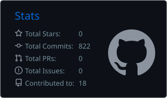
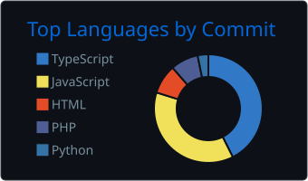
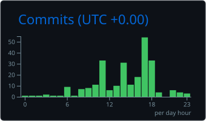

<!-- Replace every YOUR_USERNAME with your GitHub username -->


<div align="center">

[](https://git.io/typing-svg)


</div>

---

## `~/whoami`

```bash
$ cat about.txt

name        : Syed Konain Nasir
role        : Full-Stack Software Engineer @ Diginfo
speciality  : full-stack development, system design, integrations
experience  : frontend, backend, databases, deployment, security, monitoring
working_on  : scalable web applications and centralized business systems
learning    : AI agent workflows, RAG, MCP, orchestration, harness engineering, loop engineering, automation tools, KSoR
```

---

## `~/stack`

**Core**

<p>
  
</p>

**Learning / Expanding**

<p>
  
</p>

---

## `~/projects`

| Project                                                                       | Description                                                       | Stack                                     |
| ----------------------------------------------------------------------------- | ----------------------------------------------------------------- | ----------------------------------------- |
| **[AutoVerse](https://github.com/konain611/AutoVerse)**                       | Agentic AI platform for generating RAG chatbot demos for websites | `TypeScript` `Python` `AI Agents` `RAG`   |
| **[Personal AI Employee](https://github.com/konain611/Personal-AI-Employee)** | Autonomous AI automation system for personal workflows            | `Python` `Obsidian` `AI Agents`           |
| **[KSoR](https://github.com/konain611/knowledge-system-of-records--ksor-)**   | Knowledge System of Record for structured and reusable knowledge  | `JavaScript` `AI`                         |
| **[DGMAGAZINE](https://dgmagazine.net)**                                      | Cyber intelligence platform in production at Diginfo              | `Next.js` `PostgreSQL` `Prisma`           |
| **[Portfolio](https://github.com/konain611/Portfolio)**                       | Personal portfolio website                                        | `Next.js` `Tailwind` `Shadcn` `Remixicon` |

---

## `~/stats`

<div align="center">





</div>

---

## `~/currently`

```diff
+ developing and maintaining production software at Diginfo
+ working with Docker, Kubernetes and CI/CD workflows
+ building AI agent workflows, RAG pipelines and MCP integrations
+ strengthening Git and software development fundamentals
+ working across development, deployment, security and monitoring
- debugging problems I definitely did not create
```

---

## `~/connect`

<div align="center">

[](https://www.linkedin.com/in/syedkonainnasir/)
[](https://syedkonain.vercel.app/)
[](mailto:konain611@gmail.com)
[](https://www.npmjs.com/~syedkonainnasir)
[](https://x.com/syedkonain_7)
[](https://wa.me/923333368339)

```text
[ connection established ]
> open to collaborations, freelance work, and interesting problems
```

</div>


